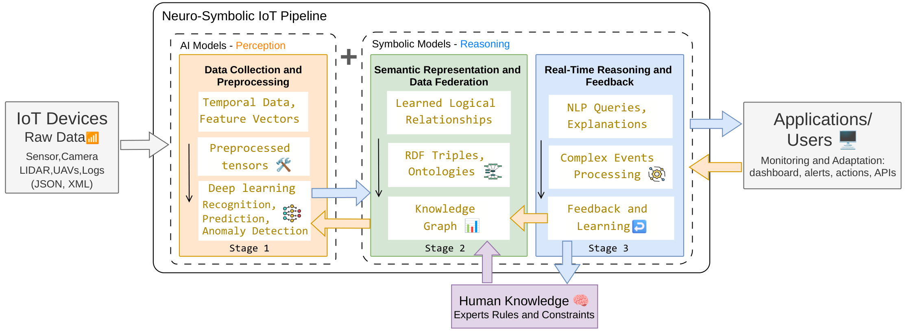

# Neuro-Symbolic IoT Pipeline

Reproducible implementation for the paper:

**Building Smarter IoT Systems: A Neuro-Symbolic Approach for Data Federation and Real-Time Processing**

A hybrid AI framework combining deep learning perception (GRU / LSTM) with OWL + SWRL symbolic reasoning over a federated knowledge graph, targeting smart-home activity recognition and ambient assisted living (AAL). The pipeline closes the loop between sub-symbolic predictions and symbolic validation via a contradiction-driven feedback mechanism.

> This repository accompanies a peer-reviewed paper submission. All identifying information has been removed. Data, model artifacts, and outputs are gitignored.



**Figure 1.** End-to-end neuro-symbolic pipeline: raw sensor streams, neural perception, knowledge-graph federation, symbolic reasoning, and feedback loop.

---

## Table of Contents

1. [Architecture](#architecture)
2. [Project Structure](#project-structure)
3. [Requirements](#requirements)
4. [Dataset Setup](#dataset-setup)
5. [Quick Start](#quick-start)
6. [Full Pipeline Usage](#full-pipeline-usage)
7. [Reproducing Paper Experiments](#reproducing-paper-experiments)
8. [SWRL Rules](#swrl-rules-11-rules)
9. [Outputs](#outputs)
10. [Configuration](#configuration)
11. [Troubleshooting](#troubleshooting)
12. [License &amp; Citation](#license--citation)

---

## Architecture

The pipeline implements three formal algorithms from the paper:

1. **Algorithm 1** — Neural-to-Semantic Federation: maps neural predictions to RDF triples
2. **Algorithm 2** — Real-Time Neuro-Symbolic Feedback Loop: contradiction detection, retraction, threshold adaptation
3. **Algorithm 3** — Dynamic Edge-Fog-Cloud Task Orchestration

### Pipeline Stages

```
[Raw Sensor Data] → [Preprocessing] → [Neural Perception (GRU/LSTM)]
        → [KG Federation (RDF)] → [Symbolic Reasoning (OWL+SWRL+HermiT)]
        → [Feedback Loop (Retraction + Threshold Adaptation)]
```

Each stage is gated by `pipeline.enable_*` flags in config, enabling ablation studies (see Table 7 in the paper).

---

## Project Structure

```
neurosymbolic_iot/
  cli/
    preprocess.py              # Dataset preprocessing CLI
    train_neural.py            # Neural model training CLI
    run_pipeline.py            # Full pipeline CLI (inference → KG → reasoning → feedback)
  data_processing/             # CASAS + SPHERE loaders, windowing, splits
  neural_perception/
    models.py                  # CasasGRUClassifier, SphereLSTMClassifier
    trainer.py                 # Training loop with class-weighted loss
    inference.py               # Softmax confidence extraction
    cross_validation.py        # Stratified k-fold CV wrapper
  kg_semantic_layer/
    ontology/
      Neuro-Symbolic IoT Smart Home Ontology.ttl          # SOSA/SAREF-aligned OWL ontology
      NeuroSymbolic_IoT_SmartHome_Ontology_SWRL_Rules.ttl # 11 SWRL rules
      sensor_map.json                                     # Sensor ID → ontology class mapping
    kg_builder/
      kg_federation_loader.py  # Algorithm 1
      rdf_writer.py            # Serialization + optional GraphDB push
  reasoning_feedback/
    reasoning/symbolic_reasoner.py  # owlready2 + HermiT + 11 SWRL rules
    feedback/feedback_loop.py       # Algorithm 2: retraction, threshold adaptation
  utils/                            # config, logging, seed (seed = 42)

config/                       # YAML configs (inherit from base.yaml)
evaluation/                   # Experiment runners (see §Reproducing Paper Experiments)
fig/                          # Figure generators (Figure_1 … Figure_8)
```

---

## Requirements

- **Python** 3.10+
- **Java** 11+ for HermiT (default reasoner). Java 25+ if you switch `reasoning.reasoner: pellet` in your config — owlready2's bundled Pellet uses Jena class-files compiled for Java 25.
- **GraphDB** *(optional — only if you want a persistent triple store)*

```bash
pip install -r requirements.txt
```

Key dependencies: `torch >= 2.0`, `rdflib >= 7.0`, `owlready2 >= 0.46`, `scikit-learn >= 1.2`, `pandas >= 2.0`, `psutil`, `matplotlib`, `pyarrow`.

Reproducibility is enforced through a global seed (42) in [neurosymbolic_iot/utils/seed.py](neurosymbolic_iot/utils/seed.py) and YAML-driven configs.

---

## Dataset Setup

The two datasets are **not redistributed** here. Request them from their original sources:

- **CASAS Kyoto ADL** — WSU CASAS smart-home project.
- **SPHERE Challenge** — University of Bristol SPHERE dataset.

Expected on-disk layout:

```
data/raw/casas_kyoto_adl/
  adl_error/*.csv
  adl_noerror/*.csv

data/raw/sphere/
  activity.csv
  acceleration_corrected.csv
  pir.csv
  ...
```

Processed parquet + metadata are generated into `data/processed/` by the preprocessing CLI. The used Raw versions used in experiments are in `data/raw.`

---

## Quick Start

Minimal end-to-end reproduction on CASAS:

```bash
# 1. Preprocess
python -m neurosymbolic_iot.cli.preprocess --config config/casas_kyoto_adl_errors.yaml --dataset casas

# 2. Train neural model (GRU activity classifier)
python -m neurosymbolic_iot.cli.train_neural --config config/base.yaml --dataset casas --task activity

# 3. Run the full neuro-symbolic pipeline
python -m neurosymbolic_iot.cli.run_pipeline \
  --config config/ns_full.yaml \
  --dataset casas --task activity \
  --model-dir outputs/neural_perception/<tag>/casas/activity
```

---

## Full Pipeline Usage

### Preprocess

```bash
python -m neurosymbolic_iot.cli.preprocess --config config/casas_kyoto_adl_errors.yaml --dataset casas
python -m neurosymbolic_iot.cli.preprocess --config config/base.yaml --dataset sphere
```

### Train Neural Models

```bash
# CASAS GRU — activity classification
python -m neurosymbolic_iot.cli.train_neural --config config/base.yaml --dataset casas --task activity

# CASAS GRU — transition detection
python -m neurosymbolic_iot.cli.train_neural --config config/base.yaml --dataset casas --task transition

# SPHERE LSTM
python -m neurosymbolic_iot.cli.train_neural --config config/base.yaml --dataset sphere
```

### Run Full Pipeline

```bash
python -m neurosymbolic_iot.cli.run_pipeline \
  --config config/ns_full.yaml \
  --dataset casas --task activity \
  --model-dir outputs/neural_perception/<tag>/casas/activity
```

Executes sequentially: (1) neural inference → (2) KG construction (Algorithm 1) → (3) OWL+SWRL reasoning (HermiT) → (4) feedback loop (Algorithm 2).

### PowerShell (Windows VS Code terminal)

```powershell
$env:PYTHONPATH="."; python evaluation/run_experiments.py --config config/base.yaml --datasets casas,sphere
```

On bash/zsh the equivalent is `PYTHONPATH=. python ...`.

---

## Reproducing Paper Experiments

All experiments are deterministic (seed = 42) and write results as JSON under `outputs/experiments/`. Each figure in the paper is regenerated from the corresponding JSON via a dedicated script in `fig/`.

### Core experiments

| Experiment                        | Script                                                                          | Figure / Table    | Paper reference |
| --------------------------------- | ------------------------------------------------------------------------------- | ----------------- | --------------- |
| 5-fold cross-validation           | [evaluation/run_cv.py](evaluation/run_cv.py)                                       | Table 2           | §4.1           |
| Noise robustness (error vs clean) | [evaluation/run_noise_robustness.py](evaluation/run_noise_robustness.py)           | Figure 4, Table 3 | §4.2           |
| Ablation (4 configs)              | [evaluation/run_experiments.py](evaluation/run_experiments.py) `--mode ablation` | Table 7           | §4.5           |
| Confusion matrices                | [fig/generate_confusion_matrices.py](fig/generate_confusion_matrices.py)           | Figure 3          | §4.1           |
| Baselines                         | [evaluation/run_experiments.py](evaluation/run_experiments.py) `--mode baseline` | Table 2           | §4.1           |

### Experimental enhancements (paper §4.4)

Five additional experiments validate specific paper claims. Each is self-contained: run the experiment, then run the figure generator.

**KG scalability (query latency vs. KG size).** Validates the "sublinear latency, <50 ms" claim by extending the benchmark from 3K to 20K triples.

```bash
PYTHONPATH=. python evaluation/run_kg_scalability.py \
  --config config/base.yaml \
  --sizes 500,1000,1500,2000,2500,3000,5000,10000,20000 \
  --trials 3
python fig/generate_kg_scalability.py
# → fig/Figure_5_query_latency_vs_triples.pdf
```

**Cross-dataset federated reasoning.** Demonstrates SWRL rule reuse across CASAS and SPHERE via a shared ontology.

```bash
PYTHONPATH=. python evaluation/run_cross_dataset_federation.py --config config/base.yaml
python fig/generate_cross_dataset_federation.py
# → fig/Figure_7_cross_dataset_federation.pdf
```

**Edge deployment latency benchmark.** CPU-only, per-window end-to-end latency grounding Algorithm 3 (neural + KG + reasoning + feedback) across batch sizes {1, 5, 10, 20, 50}.

```bash
PYTHONPATH=. python evaluation/run_edge_latency.py \
  --config config/base.yaml \
  --batch-sizes 1,5,10,20,50 --trials 5
python fig/generate_edge_latency.py
# → fig/Figure_8_edge_latency.pdf
```

**Feedback-cycle ablation (mechanism stress-test).** Tracks per-cycle weighted F1, false-positive rate, and correctness under a controlled 20\% false-positive injection regime. Characterises the loop's correction policy under a known FP load — *not* a measurement of held-out activity-recognition accuracy.

```bash
PYTHONPATH=. python evaluation/run_feedback_cycle_ablation.py --config config/ns_full.yaml
python fig/generate_feedback_cycle_ablation.py
# → fig/Figure_6_feedback_cycle_ablation.pdf
```

**Held-out feedback-cycle evaluation (real-data).** Companion to the stress-test above. Runs the actual GRU/LSTM inference, builds the real RDF graph, calls the HermiT-driven feedback loop, and measures per-cycle weighted F1 against the dataset annotation columns. Excludes by construction any rule-vs-label circularity (metadata block in the JSON records `rule_label_disjoint=true`). Requires a JRE 11+ on PATH.

```bash
PYTHONPATH=. python evaluation/run_feedback_cycle_real.py \
  --config config/ns_full.yaml \
  --casas-model-dir outputs/neural_perception/<tag>/casas/activity \
  --sphere-model-dir outputs/neural_perception/<tag>/sphere \
  --max-cycles 5
# → outputs/experiments/feedback_cycle_real/feedback_cycle_real_results.json
```

**Confidence-threshold sensitivity.** Sweeps validation / anomaly / feedback thresholds to characterise operating-point trade-offs. Not added in the paper cause page number limit.

```bash
PYTHONPATH=. python evaluation/run_threshold_sensitivity.py --config config/base.yaml
python fig/generate_threshold_sensitivity.py
# → fig/Figure_9_threshold_sensitivity.pdf
```

**Deterministic 5-fold ablation on CASAS Aruba (R2.1, Table 11).** Trains a fresh GRU per fold under per-fold seeding + `torch.use_deterministic_algorithms(True)`, evaluates the four ablation configurations on the held-out fold, runs paired Wilcoxon signed-rank tests + Cohen's d. Uses the Aruba subset of the Zenodo CASAS labeled release (doi:10.5281/zenodo.15708568) — `data/raw/casas_aruba/labeled/hh101.csv`. CPU-only takes ~8 h; ~25 min on a GPU.

```bash
# 1. Download labeled_data.zip from https://zenodo.org/records/15708568
#    and extract so the file lives at data/raw/casas_aruba/labeled/hh101.csv
# 2. Run the deterministic 5-fold ablation:
PYTHONHASHSEED=42 PYTHONPATH=. python evaluation/run_ablation_cv.py \
  --config config/casas_aruba.yaml --k 5 --epochs 30 \
  --cep-latency 12.4 --outdir evaluation/results_aruba
# → evaluation/results_aruba/ablation_cv.json
# Result (Seed=42, n_windows=1792, 11 classes):
#   AI-Only   F1-w 83.4 ± 7.0 %  | NeSy-Full  F1-w 85.0 ± 6.4 %
#   Paired Wilcoxon (one-sided): W=15, p=0.0312, Cohen's d=+2.48 (large)
```

### Figure-to-generator map

| Figure   | Artefact                           | Generator                                                                     |
| -------- | ---------------------------------- | ----------------------------------------------------------------------------- |
| Figure 1 | Pipeline architecture              | static asset                                                                  |
| Figure 2 | Data flow                          | static asset                                                                  |
| Figure 3 | Confusion matrices (CASAS, SPHERE) | [generate_confusion_matrices.py](fig/generate_confusion_matrices.py)             |
| Figure 4 | Noise robustness                   | [generate_noise_robustness.py](fig/generate_noise_robustness.py)                 |
| Figure 5 | Query latency vs. KG size          | [generate_kg_scalability.py](fig/generate_kg_scalability.py)                     |
| Figure 6 | Feedback-cycle ablation            | [generate_feedback_cycle_ablation.py](fig/generate_feedback_cycle_ablation.py)   |
| Figure 7 | Cross-dataset federation           | [generate_cross_dataset_federation.py](fig/generate_cross_dataset_federation.py) |
| Figure 8 | Edge deployment latency            | [generate_edge_latency.py](fig/generate_edge_latency.py)                         |
| Figure 9 | Threshold sensitivity              | [generate_threshold_sensitivity.py](fig/generate_threshold_sensitivity.py)       |

### Expected runtime (reference machine: 8-core CPU, 32 GB RAM, NVIDIA RTX 3060 GPU)

| Stage                                 | Dataset | Approx. wall time |
| ------------------------------------- | ------- | ----------------- |
| Preprocess                            | CASAS   | 1–2 min          |
| Preprocess                            | SPHERE  | 2–4 min          |
| Train neural (GRU/LSTM)               | each    | 3–8 min          |
| Full pipeline (single run)            | each    | 1–3 min          |
| KG scalability (full sweep)          | both    | 10–20 min        |
| Edge deployment (full sweep)         | both    | 5–10 min         |
| Cross-dataset federated and Ablation | each    | 2–8 min          |

---

## SWRL Rules (11 Rules)

| #  | Category                  | Description                                                        |
| -- | ------------------------- | ------------------------------------------------------------------ |
| 1  | Sensor Grounding          | PIR motion → person location                                      |
| 2  | Sensor Grounding          | Appliance interaction → person location                           |
| 3  | Neuro-Symbolic Validation | High-confidence meal preparation (Kitchen + conf > 0.85)           |
| 4  | Neuro-Symbolic Validation | Posture-based sleeping (Bedroom + Lying + conf > 0.80)             |
| 5  | AAL Anomaly Detection     | Critical fall detection (Bathroom + Lying)                         |
| 6  | AAL Anomaly Detection     | Unattended fire hazard (Kitchen appliance ON + person in Bedroom)  |
| 7  | AAL Anomaly Detection     | Night wandering / sleep disturbance                                |
| 8  | Feedback Trigger          | Spatial hallucination (low confidence + quiet sensors)             |
| 9  | Feedback Trigger          | Contextual hallucination (sleeping in living room + TV ON)         |
| 10 | Feedback Trigger          | Mutually exclusive predictions (PersonalHygiene + MealPreparation) |
| 11 | Feedback Trigger          | Posture-based fall detection (Lying + quiet PIR sensors)           |

Rules are defined programmatically via `owlready2.Imp()` in [symbolic_reasoner.py](neurosymbolic_iot/reasoning_feedback/reasoning/symbolic_reasoner.py). A human-readable reference is provided in `ruleset.swrl`.

**Disjointness of feedback rules and ground-truth labels.** Only rules 8–11 (Feedback Trigger) emit `FeedbackRequired` assertions consumed by the feedback loop. Rules 1–7 perform sensor grounding, validation, or anomaly detection and do not influence the F1 measurement. Ground-truth labels for evaluation come exclusively from the dataset annotation columns (CASAS `activity`, SPHERE activity/posture class). The set of rules participating in feedback is therefore disjoint from the artefacts defining the labels — the held-out F1 cannot be a self-consistency artefact at the rule level.

**Reasoner backend.** The reasoning stage selects between HermiT (default, Java 11+) and Pellet (Java 25+, bundled with owlready2) via `reasoning.reasoner` in the config. Both reasoners run OWL-DL classification through owlready2's wrappers; direct execution of arbitrary SWRL rule bodies (variable chaining + `swrlb` data-property comparisons) requires invoking Pellet's `infer` CLI subcommand outside the binding and is treated as future work.

---

## Outputs

```
outputs/
  neural_perception/<tag>/<dataset>/<task>/
    model.pth, metrics.json, label_map.json, vocab.json, confusion_*.csv
  kg/<dataset>/populated_kg.ttl
  reasoning/<dataset>/reasoning_result.json
  feedback/<dataset>/feedback_cycles.json
  pipeline/<dataset>/<tag>/pipeline_result.json
  experiments/
    kg_scalability/kg_scalability_results.json
    cross_dataset_federation/cross_dataset_results.json
    feedback_cycle_real/feedback_cycle_real_results.json
    edge_latency/edge_latency_results.json
    feedback_cycle_ablation/feedback_cycle_results.json
    threshold_sensitivity/threshold_sensitivity_results.json
    noise_robustness/noise_robustness_results.json

evaluation/results_aruba/                    # R2.1 deterministic 5-fold CV result (Aruba)
  ablation_cv.json                            # aggregated — TRACKED in git
  fold_{0..4}/                                # per-fold artefacts — gitignored
    metrics.json, confusion_{val,test}.csv,
    kg/casas/populated_kg.ttl,
    reasoning/casas/reasoning_result.json
```

All `outputs/` paths and `evaluation/results_aruba/fold_*/` are gitignored.

---

## Configuration

All configs inherit from [config/base.yaml](config/base.yaml) via the `extends` key. Load configs through `load_config()` in [utils/config.py](neurosymbolic_iot/utils/config.py) — never parse YAML directly.

| Section                 | Controls                                                                                        |
| -------------------------------- | ----------------------------------------------------------------------------------------------- |
| `datasets`                     | Raw data paths, windowing, split ratios                                                         |
| `neural_perception`            | Model hyperparameters (GRU/LSTM), training settings                                             |
| `kg`                           | Ontology path, sensor map, optional GraphDB connection                                          |
| `reasoning`                    | Confidence thresholds (validation 0.85, anomaly 0.85, feedback 0.70)                            |
| `feedback`                     | Max cycles (5), retrain buffer size (500), adjustment rate (0.05)                               |
| `pipeline`                     | Stage enable flags (`enable_neural`, `enable_kg`, `enable_symbolic`, `enable_feedback`) |

Ablation configs: `ai_only.yaml`, `kg_only.yaml`, `ns_nofeedback.yaml`, `ns_full.yaml`.

---

## Troubleshooting

| Issue                                         | Fix                                                            |
| --------------------------------------------- | -------------------------------------------------------------- |
| `KeyError: 'datasets'`                      | Use a config with a `datasets` section (e.g. `base.yaml`)  |
| Timezone errors (tz-aware vs. tz-naive)       | Handled in `train_neural.py` — timestamps normalised to UTC |
| Java not found (HermiT fails)                 | Install JRE/JDK 11+; owlready2 needs it for reasoning          |
| GraphDB push fails                            | Optional — set `kg.graphdb.enabled: false` (default)        |
| Config `inherits` not working               | Use `extends` (not `inherits`)                             |
| `ModuleNotFoundError` on experiment scripts | Run with `PYTHONPATH=.` from the repo root                   |

---

## License & Citation

This repository is released under the MIT License (see `LICENSE`, if present).

```bibtex
@misc{neurosymbolic_iot_pipeline_repo,
  author       = {Anonymous Authors},
  title        = {Neuro-Symbolic IoT Pipeline: Reproducible Experiments},
  howpublished = {\url{<https://anonymous.4open.science/r/neurosymbolic-iot-pipeline-9556>}},
  year         = {2026},
  note         = {Code anonymised for peer review.}
}
```
